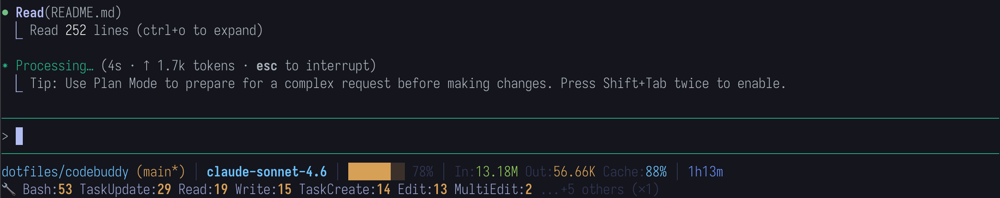

# statusline.sh — AI 编程助手状态栏脚本

适用于 **CodeBuddy Code** 和 **Claude Code**，从 stdin 读取 JSON，解析会话 transcript，在终端输出两行彩色状态信息。

---

## 输出示例



```
dotfiles/codebuddy (main*) │ claude-sonnet-4-6 │ ████░░░░ 42% │ In:50.00K Out:3.00K Cache:20% │ 3m25s
🔧 Read:12 Edit:5 Bash:3 ...+2 others (×1)
```

- **第 1 行**：始终显示，包含目录、模型、上下文用量、token 数、运行时长
- **第 2 行**：仅当本次会话有工具调用时显示

---

## 快速上手

### CodeBuddy Code

在 `~/.codebuddy/settings.json` 中配置：

```json
{
  "statusLine": {
    "type": "command",
    "command": "~/.codebuddy/statusline.sh"
  }
}
```

也可以显式指定 `/bin/bash`（脚本无需可执行权限）：

```json
{
  "statusLine": {
    "type": "command",
    "command": "/bin/bash ~/.codebuddy/statusline.sh"
  }
}
```

> 两种写法均可。直接写脚本路径时，需确保脚本有可执行权限（`chmod +x`）且首行包含 shebang（如 `#!/usr/bin/env bash`）。

可以用符号链接将脚本放到配置目录：

```bash
ln -sf /path/to/statusline.sh ~/.codebuddy/statusline.sh
```

### Claude Code

在 `~/.claude/settings.json`（或项目级 `.claude/settings.json`）中配置：

```json
{
  "statusLine": {
    "type": "command",
    "command": "~/.claude/statusline.sh"
  }
}
```

同样支持显式指定 `/bin/bash`：

```json
{
  "statusLine": {
    "type": "command",
    "command": "/bin/bash ~/.claude/statusline.sh"
  }
}
```

### 注意事项

- 若脚本通过**符号链接**调用，主入口已使用 `readlink -f` 解析真实路径，`lib/` 模块可被正确找到，无需特殊处理。
- 脚本依赖 `jq`（>= 1.6）、`git`、`awk`、`sort`、`mktemp`，macOS 和主流 Linux 发行版均已内置。

---

## 目录结构

```
codebuddy/
├── statusline.sh              # 主入口（21 行）
├── README.md
├── lib/
│   ├── format.sh              # 格式化工具函数（纯函数，无副作用）
│   ├── parse_input.sh         # 从 stdin 解析 JSON 输入
│   ├── parse_transcript.sh    # 解析 .jsonl transcript 文件
│   ├── git_info.sh            # 检测 git 仓库状态
│   └── render.sh              # 组装并输出两行状态栏
└── tests/
    ├── run_tests.sh           # 测试套件（61 个用例）
    └── fixtures/
        ├── transcript_normal.jsonl        # 普通 CodeBuddy 会话
        ├── transcript_with_compact.jsonl  # 含 Compact 操作的会话
        ├── transcript_many_singles.jsonl  # 多个单次工具（测试折叠逻辑）
        └── transcript_claudecode.jsonl    # ClaudeCode 格式会话
```

---

## 模块详解

### `statusline.sh`（主入口）

按顺序 `source` 各模块，模块间通过共享 bash 变量传递数据：

```bash
source lib/format.sh          # 需最先加载
source lib/parse_input.sh     # 读取 stdin
source lib/parse_transcript.sh
source lib/git_info.sh
source lib/render.sh          # 最终输出
```

使用 `readlink -f` 解析脚本真实路径，确保符号链接场景下 `lib/` 路径正确。

---

### `lib/format.sh`

纯函数，无副作用，无外部依赖。

| 函数 | 输入 | 输出示例 |
|------|------|----------|
| `format_duration <seconds>` | `205` | `3m25s` |
| `format_number <number>` | `50000` | `50.00K` |
| `get_context_color <pct>` | `80` | `\033[0;33m`（黄色）|
| `build_progress_bar <pct>` | `42` | `███░░░░░ ` |

颜色阈值：`< 75%` 绿色 / `>= 75%` 黄色 / `>= 90%` 红色

---

### `lib/parse_input.sh`

从 **stdin** 读取 JSON，单次 `jq` 调用提取 10 个字段：

| 变量 | JSON 路径 |
|------|-----------|
| `current_dir` | `workspace.current_dir` |
| `model_display` / `model_id` | `model.display_name` / `model.id` |
| `transcript_path` | `transcript_path` |
| `context_used_pct` | `context_window.used_percentage` |
| `context_input_tokens` / `context_output_tokens` | `context_window.total_*_tokens` |
| `cache_read_tokens` / `cache_creation_tokens` | `context_window.current_usage.*` |
| `total_duration_ms` | `cost.total_duration_ms` |

同时构建 `display_identifier`（`project/dir` 双层路径）并初始化 `runtime`。

---

### `lib/parse_transcript.sh`

解析 `.jsonl` 格式的会话记录文件，兼容两种格式：

**格式对比：**

| 字段 | CodeBuddy | ClaudeCode |
|------|-----------|------------|
| 工具调用记录 | `type: "function_call"` 或 `assistant.message.content[].type == "tool_use"` | 顶级 `type: "tool_use"` |
| 工具名字段 | `.name` | `.tool_name` |
| timestamp 格式 | 毫秒整数（如 `1700000000000`） | ISO 8601 字符串（如 `"2026-03-06T15:02:59.559Z"`） |

**Compact 感知：**
- 检测会话中最后一次 `Compact Instructions` 消息的时间戳
- token 统计**仅计 compact 之后**的记录
- 工具调用和会话时长**保持全局统计**（不受 compact 影响）

**输出变量：** `input_tokens`, `output_tokens`, `tool_calls`, `runtime`, `tool_counts_file`

---

### `lib/git_info.sh`

检测工作目录的 git 状态，输出变量：

| 变量 | 含义 |
|------|------|
| `branch` | 当前分支名（空字符串表示不在 git 仓库） |
| `git_is_dirty` | `1` = 有未提交修改，`0` = 干净 |

---

### `lib/render.sh`

组装并输出两行状态栏：

**第 1 行结构：**
```
{目录} {git分支} │ {模型名} │ {进度条} {上下文%} │ In:{输入} Out:{输出} [Cache:{命中%}] │ {时长}
```

**第 2 行（有工具调用时）：**
```
🔧 {Tool1}:{N} {Tool2}:{N} ...+N others (×1)
```

**Token 回退逻辑：** transcript 解析无数据时，自动回退到 stdin `context_window` 中的 token 数。

**工具折叠逻辑：**

| 情形 | 显示策略 |
|------|----------|
| 全部工具只调用 1 次 | 逐个列出 |
| 有多次调用工具，且仅 1 个工具只调用 1 次 | 全部列出（含计数） |
| 有多次调用工具，且 ≥2 个工具只调用 1 次 | 高频工具展示计数，低频折叠为 `...+N others (×1)` |

---

## 运行测试

```bash
bash tests/run_tests.sh
```

测试覆盖：

| 分组 | 用例数 | 覆盖场景 |
|------|--------|----------|
| 基础输出结构 | 7 | 第 1 行各字段是否存在 |
| transcript=null | 4 | stdin 回退逻辑 |
| 普通会话 (CodeBuddy) | 8 | token/时长/工具行/折叠 |
| ClaudeCode 格式 | 8 | 顶级 tool_use、ISO 时间戳、时长优先级 |
| Compact 感知 | 3 | token 边界、全局工具统计 |
| 工具折叠逻辑 | 4 | 折叠条件、×1 符号 |
| Cache 命中率 | 1 | 百分比计算 |
| 上下文颜色阈值 | 3 | 绿/黄/红三级颜色 |
| 模型名截断 | 2 | display_name 过长时回退 |
| 目录标识 | 2 | 单层/双层路径 |
| 边界值（空输入） | 5 | 空 JSON、不存在 transcript、0%/100% |
| format_number | 8 | K/M/B 边界、非数字输入 |
| format_duration | 6 | 秒/分/时边界 |
| **合计** | **61** | |

---

## 依赖项

| 工具 | 用途 | 版本要求 |
|------|------|----------|
| `jq` | JSON 解析 | >= 1.6（需要 `gsub` 函数） |
| `git` | 仓库状态检测 | 任意版本 |
| `awk` | 工具统计折叠 | BSD awk / GNU awk 均可 |
| `sort` / `uniq` | 工具调用频次统计 | 系统内置 |
| `mktemp` | 临时文件 | 系统内置 |

---

## 设计决策

1. **`source` 方式加载模块**：各模块共享同一进程变量空间，无需管道/导出，最简单且无性能开销
2. **`readlink -f` 解析符号链接**：确保通过 symlink 调用时，`lib/` 路径基于脚本真实位置而非链接位置
3. **单次 jq 调用**：stdin JSON 字段一次性全部提取
4. **Compact 感知**：区分 compact 前后 token，让显示值与当前上下文窗口对应
5. **双格式兼容**：同时支持 CodeBuddy 和 ClaudeCode 两种 transcript 格式
6. **timestamp 兼容**：自动区分毫秒整数（CodeBuddy）和 ISO 8601 字符串（ClaudeCode）
7. **awk `-v` 传递 Unicode 符号**：避免 BSD awk 不支持 octal 字节序列（`×` 符号）
8. **token 回退机制**：transcript 无数据时自动回退到 stdin `context_window` 数据
